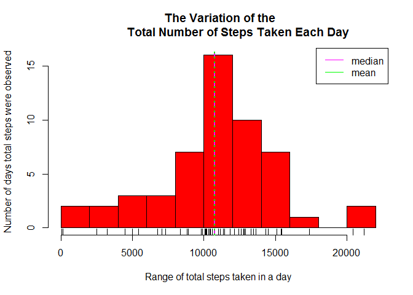
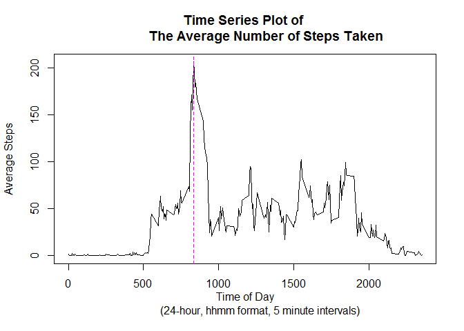
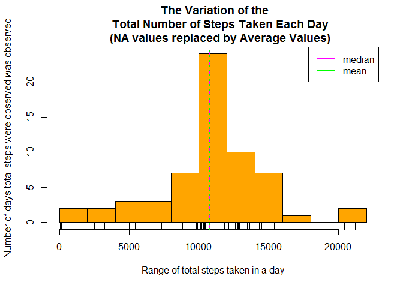
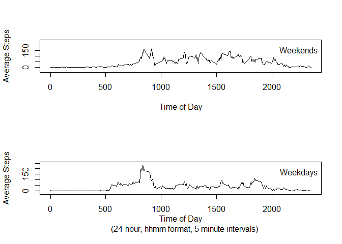

# Reproducible Research: Peer Assessment 1


## Loading and preprocessing the data

Create a data directory, download compressed file and unzip


```r
if (!file.exists("./data/activity.csv")) {
  if(!file.exists("./data")) {dir.create("./data")}
  
  fileUrl <- "https://d396qusza40orc.cloudfront.net/repdata%2Fdata%2Factivity.zip"
  
  download.file(fileUrl, destfile="./data/repdata-activity.zip")
  
  unzip(zipfile="./data/repdata-activity.zip", exdir = "./data")

}
```

Here is a  function to check missing values in a column, to work with data tables
(colvar is the column to work on, can be a string or an integer)

```r
totalMissingValues <- function(dTable, colvar) { 
    naStepsTrueFalse <- is.na(dTable[,colvar,with=FALSE])
  
  length(naStepsTrueFalse[naStepsTrueFalse > 0])
}
```


Read in the data as a data table

```r
library(data.table)
dt.Activity <- data.table(read.csv("./data/activity.csv"))
```

####Some initial observations of this data

```r
str(dt.Activity)
```

```
## Classes 'data.table' and 'data.frame':	17568 obs. of  3 variables:
##  $ steps   : int  NA NA NA NA NA NA NA NA NA NA ...
##  $ date    : Factor w/ 61 levels "2012-10-01","2012-10-02",..: 1 1 1 1 1 1 1 1 1 1 ...
##  $ interval: int  0 5 10 15 20 25 30 35 40 45 ...
##  - attr(*, ".internal.selfref")=<externalptr>
```

```r
steps_TotalMissingValues <- totalMissingValues(dt.Activity, "steps")
print(c("Total NA steps:",steps_TotalMissingValues[1]), quote=FALSE)
```

```
## [1] Total NA steps: 2304
```


## What is mean total number of steps taken per day?

A histogram to show the variation

```r
stepsBydate <- dt.Activity[,.(Total=sum(steps)), by = date]

hist(stepsBydate[Total != "NA",]$Total, 
     breaks = 8,
     col = "red",
     xlab = "Range of total steps taken in a day",
     ylab = "Number of days total steps were observed",
     main = " The Variation of the
             Total Number of Steps Taken Each Day"
     )

rug(stepsBydate[Total != "NA",]$Total)

abline(v = median(stepsBydate[Total != "NA",]$Total), col="magenta", lty = 2, lwd = 2)
abline(v = mean(stepsBydate[Total != "NA",]$Total), col="green", lty = 3, lwd = 2)
legend("topright", lty = 1, col = c("magenta", "green"), legend = c("median", "mean"))
```

 


```r
stepsMean <- as.integer(mean(stepsBydate[Total != "NA",]$Total))
stepsMedian <- median(stepsBydate[Total != "NA",]$Total)
```

The mean total number of steps taken per day is 10766. 

The median is 10765.


## What is the average daily activity pattern?

A Time series plot of the average number of steps taken


```r
timeSeries <- dt.Activity[,.(AverageSteps = mean(steps, na.rm = TRUE)), by = interval]
plot(timeSeries$interval, timeSeries$AverageSteps, type = "l",
     xlab = "Time of Day
            (24-hour, hhmm format, 5 minute intervals) ",
     ylab = "Average Steps",
     main = "Time Series Plot of 
            The Average Number of Steps Taken"
    )
maxAvStepsCoords <- timeSeries[AverageSteps == max(timeSeries$AverageSteps),]

abline(v = maxAvStepsCoords$interval, col="magenta", lty = 2, lwd = 1)
```

 

[//]: (The 5-minute interval that, on average, contains the maximum number of steps)

The time of day where there are, on average, the  
most steps counted in a five minute interval: 
835 (24-hour clock, hhmm format, no leading zeros)  


## Imputing missing values

Devise a strategy for filling in all of the missing values in the dataset.   
[//]: (The strategy does not need to be sophisticated)

I have opted to utilise the timeSeries averages, such that
for NA steps found in a particular interval the NA is replaced with the
average steps over all days for that interval.


```r
dt.Act2 <- copy(dt.Activity)
dt.Act2[,steps := as.numeric(steps)] # so steps accepts real numbers from averages
for (i in 1:nrow(dt.Act2)) {
  if (dt.Act2[i, is.na(steps)]) {
    av <- timeSeries[interval==dt.Act2[i]$interval]$AverageSteps
    dt.Act2[i ,steps := av]
  }
}
```

A histogram using the modified data, i.e. where NA values are replaced using the method above

```r
stepsBydate_NoNA <- dt.Act2[,.(Total=sum(steps)), by = date]
hist(stepsBydate_NoNA$Total, 
     breaks = 8,
     col = "orange",
     xlab = "Range of total steps taken in a day",
     ylab = "Number of days total steps were observed was observed",
     main = " The Variation of the
     Total Number of Steps Taken Each Day
     (NA values replaced by Average Values)"
)
rug(stepsBydate_NoNA$Total)

abline(v = median(stepsBydate_NoNA$Total), col="magenta", lty = 2, lwd = 2) # MEDIAN
abline(v = mean(stepsBydate_NoNA$Total), col="green", lty = 3, lwd = 2)
legend("topright", lty = 1, col = c("magenta", "green"), legend = c("median", "mean"))
```

 


```r
stepsMeanNoNA <- as.integer(mean(stepsBydate_NoNA$Total))
stepsMedianNoNA <- median(stepsBydate_NoNA$Total)
```

With NA values replaced, we see that the mean is 10766 and the median is 1.0766189\times 10^{4}.

As there is very little change between these figures and those of data with NA, it is quite possible that the intervals that hold NA values are intervals where very little activity happened anyway, e.g. during regular sleeping periods.

For example

```r
head(dt.Activity)
```

```
##    steps       date interval
## 1:    NA 2012-10-01        0
## 2:    NA 2012-10-01        5
## 3:    NA 2012-10-01       10
## 4:    NA 2012-10-01       15
## 5:    NA 2012-10-01       20
## 6:    NA 2012-10-01       25
```

## Are there differences in activity patterns between weekdays and weekends?

Add columns to filter weekend dates


```r
library(lubridate)
```

```
## 
## Attaching package: 'lubridate'
## 
## The following objects are masked from 'package:data.table':
## 
##     hour, mday, month, quarter, wday, week, yday, year
```

```r
library(dplyr)
```

```
## 
## Attaching package: 'dplyr'
## 
## The following objects are masked from 'package:lubridate':
## 
##     intersect, setdiff, union
## 
## The following objects are masked from 'package:data.table':
## 
##     between, last
## 
## The following objects are masked from 'package:stats':
## 
##     filter, lag
## 
## The following objects are masked from 'package:base':
## 
##     intersect, setdiff, setequal, union
```

```r
dt.Act3 <- dt.Act2[, day := weekdays(ymd(date))]
for (i in 1:nrow(dt.Act3)) {
   whatDay <- dt.Act3[i]$day
   if (whatDay == "Saturday" | whatDay == "Sunday") {
          dt.Act3[i ,dayType := as.factor("weekend")]
   }
   else {
     dt.Act3[i ,dayType := as.factor("weekday")]
   }
}
for (i in 1:nrow(dt.Act3)) {
     whatDay <- dt.Act3[i]$day
     if (whatDay == "Saturday" | whatDay == "Sunday") {
       dt.Act3[i , wEnd := TRUE]
     }
     else {
       dt.Act3[i , wEnd := FALSE]
     }
  }
###################### Split it apart...
act3.wEnd <- filter(dt.Act3, dayType == "weekend")
timeSeries.wEnd <- act3.wEnd[,.(AverageSteps = mean(steps, na.rm = TRUE)), by = interval]

act3.wDay <- filter(dt.Act3, dayType == "weekday")
timeSeries.wDay <- act3.wDay[,.(AverageSteps = mean(steps, na.rm = TRUE)), by = interval]
```

Compare graphs of activity patterns between weekdays and weekends

```r
par(mfrow = c(2,1))

plot(timeSeries.wEnd$interval, timeSeries.wEnd$AverageSteps, type = "l",
     asp = 1,
     xlab = "Time of Day",
     ylab = "Average Steps",
     ylim = c(0, 200)
     )
legend("topright", bty = "n", legend = "Weekends")

plot(timeSeries.wDay$interval, timeSeries.wDay$AverageSteps, type = "l",
     asp = 1,
     xlab = "Time of Day
     (24-hour, hhmm format, 5 minute intervals) ",
     ylab = "Average Steps"
     )
legend("topright", bty = "n", legend = "Weekdays")
```

 
